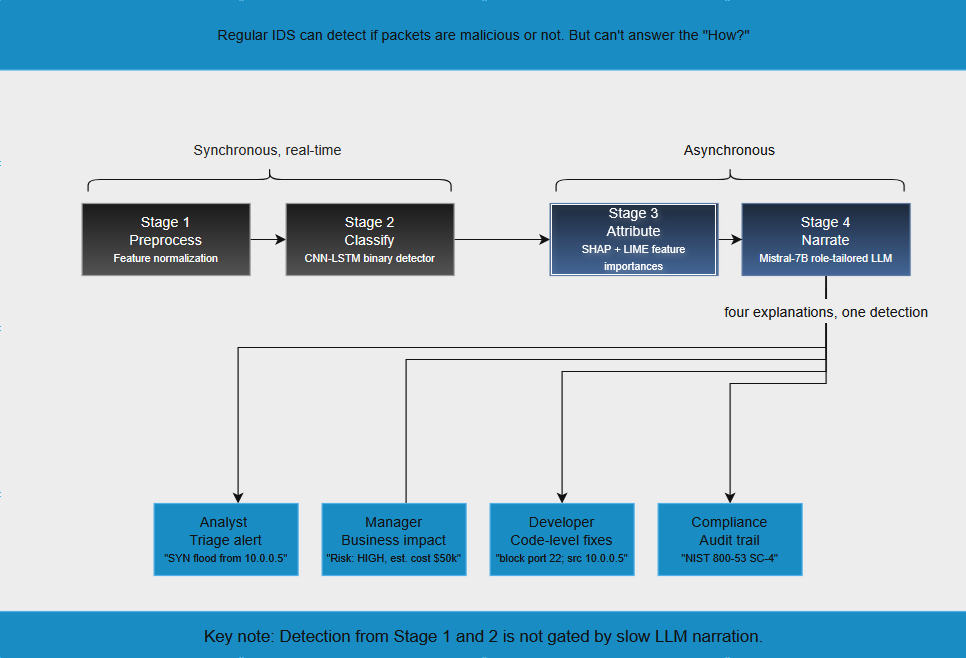

# XAI LLM Network Packet Analysis

Explainable AI framework for network intrusion detection using a CNN-LSTM classifier with SHAP/LIME attribution and a local LLM (Mistral-7B) for stakeholder-specific explanations.

This repository supports the thesis:

> *Explainable Artificial Intelligence (XAI) Using LLMs in Network Packet Analysis*

## Overview

The framework classifies network packets using a CNN-LSTM hybrid model evaluated on **UNSW-NB15** and **NSL-KDD** benchmark datasets. SHAP and LIME produce feature attributions; a locally deployed Mistral-7B LLM translates these into role-tailored narratives for four stakeholder types (Security Analyst, IT Manager, Software Developer, Compliance Officer).



## Results

| Metric | Value |
|---|---|
| Accuracy (combined test set) | **96.76%** |
| F1-Score | 0.9675 |
| ROC-AUC | 0.9952 |
| XAI sufficiency (top-3) | 0.9390 |
| SHAP-LIME top-3 Jaccard | 0.122 |
| LLM generation success | 100% |
| Estimated LLM hallucination | 5.5% |

The CNN-LSTM loses to gradient-boosted trees on raw accuracy (a well-documented pattern for tabular data); the contribution is the integrated four-tier XAI + role-tailored LLM pipeline that tabular baselines cannot provide.

## Repository Layout

```
.
├── thesis_main.tex        # LaTeX source for the thesis
├── thesis_main.pdf        # Compiled PDF
├── references.bib         # BibTeX bibliography
├── data_preprocessing.py  # Load and preprocess NSL-KDD / UNSW-NB15
├── improved_cnn_lstm_classifier.py   # CNN-LSTM model definition + training
├── evaluation_metrics.py  # Compute accuracy, F1, precision, recall
├── xai_visualization.py   # SHAP/LIME attribution and figures
├── llm_explanation_generator_gguf.py # Local Mistral-7B integration
├── improved_main_workflow.py         # Orchestrator: train -> eval -> XAI -> LLM
├── visualizations/        # Figures embedded in the thesis (PNG)
├── docs/                  # INSTALL.md, EXPERIMENTS.md
├── LICENSE
├── README.md
└── requirements.txt
```

## Setup

### Python environment

```bash
conda create -n xai-llm python=3.11
conda activate xai-llm
pip install -r requirements.txt
```

### Datasets

The datasets are **not included** in this repository due to size. Download them manually:

- **NSL-KDD**: <https://www.unb.ca/cic/datasets/nsl.html> → extract into `Data/NSL_KDD/`
- **UNSW-NB15**: <https://research.unsw.edu.au/projects/unsw-nb15-dataset> → extract into `Data/UNSW_NB15/`

### Local LLM

Install `llama-cpp-python` and download a GGUF-quantized Mistral-7B-Instruct model (Q4_K_M). See [docs/INSTALL.md](docs/INSTALL.md) for details.

## Reproducing the Results

See [docs/EXPERIMENTS.md](docs/EXPERIMENTS.md) for the full reproduction recipe.

Quick start:
```bash
python data_preprocessing.py
python improved_main_workflow.py
python xai_visualization.py
python evaluation_metrics.py
python llm_explanation_generator_gguf.py
```

## Building the Thesis PDF

```bash
make
```

Or manually:
```bash
pdflatex thesis_main.tex
biber thesis_main
pdflatex thesis_main.tex
pdflatex thesis_main.tex
```

## Citation

```bibtex
@mastersthesis{saleh2026xai,
  author  = {Saleh, Youssef},
  title   = {Explainable Artificial Intelligence (XAI) Using LLMs in Network Packet Analysis},
  school  = {University of Idaho},
  year    = {2026},
  type    = {{M.S.} thesis}
}
```

## License

MIT License. See [LICENSE](LICENSE).